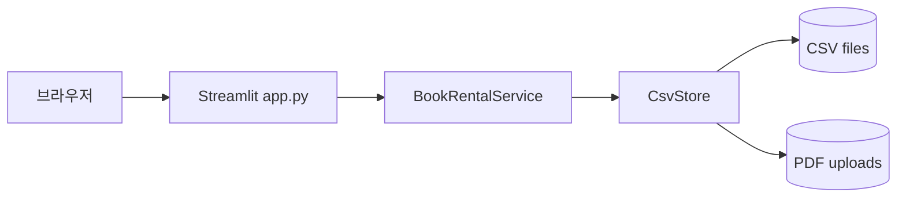
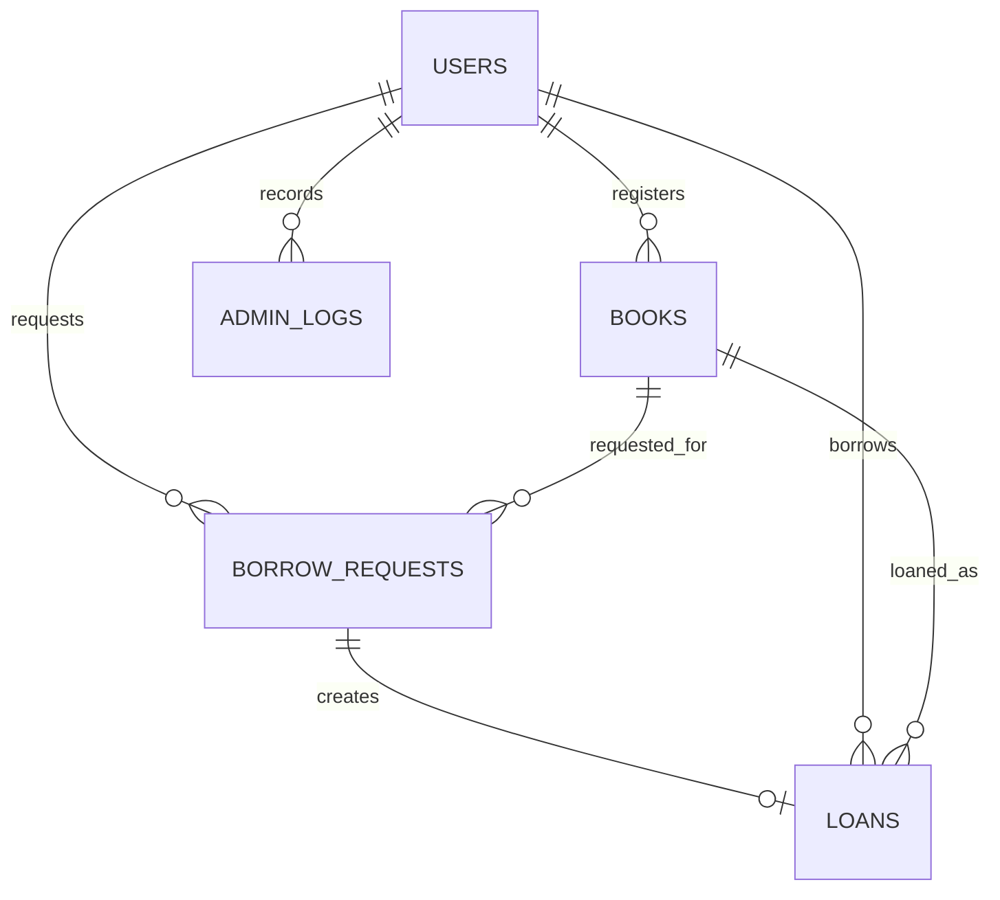

# BookBridge Streamlit + CSV 아키텍처

## 1. 전환 범위

기존 구조의 Spring Boot REST API, JPA/MySQL, React SPA를 제거하고 Streamlit 단일 프로세스로 통합했다. 기존 핵심 흐름인 책 등록과 승인, 대여 요청과 승인, 재고 차감, 반납과 재고 복구, 연체, 관리자 집계를 유지한다.

## 2. 계층

### UI (`app.py`)

Streamlit 사이드바에서 현재 사용자를 선택하고 역할에 맞는 메뉴를 노출한다. 화면은 서비스 메서드만 호출하며 CSV를 직접 수정하지 않는다.

### 서비스 (`book_rental/service.py`)

다음 도메인 규칙을 담당한다.

- 역할과 활성 사용자 확인
- 책/PDF 입력 검증
- 승인 대기 책의 승인과 거절
- 승인된 책에 대한 대여 요청
- 승인 시점 재고 재검사, 재고 차감, 대출 생성
- 반납 권한 확인, 재고 복구
- 대출 기한을 기준으로 연체 동기화
- 관리자 집계와 감사 로그

### 저장소 (`book_rental/store.py`)

CSV 헤더를 스키마로 관리하고 UTF-8로 읽고 쓴다. 변경 작업은 `fcntl` 배타 잠금으로 직렬화한다. 각 파일은 같은 디렉터리의 임시 파일에 기록하고 `os.replace`로 교체한다. 여러 파일 변경 중 예외가 발생하면 모든 CSV를 트랜잭션 전 백업으로 되돌린다.

## 3. CSV 모델

- `users.csv`: 사용자와 `|`로 구분한 복수 역할
- `books.csv`: 책, 수량, 승인 상태, PDF 경로
- `borrow_requests.csv`: 대여 요청과 처리 상태
- `loans.csv`: 승인된 요청의 대출, 기한, 반납 상태
- `admin_logs.csv`: 도서/대여 승인 및 거절 감사 기록

## 4. 상태 흐름

- 책: `PENDING` → `APPROVED` 또는 `REJECTED`
- 대여 요청: `REQUESTED` → `APPROVED` 또는 `REJECTED`
- 대출: `LOANED` → `OVERDUE` → `RETURNED`, 또는 `LOANED` → `RETURNED`

대여 요청을 생성할 때 가용 수량을 빠르게 확인하지만 재고를 예약하지 않는다. 관리자가 승인할 때 잠금 안에서 수량을 다시 검사하고, 책/요청/대출 CSV를 함께 갱신한다. 따라서 앞선 요청이 재고를 소진하면 뒤 요청은 승인되지 않고 `REQUESTED` 상태를 유지한다.

## 5. 운영 한계

CSV는 별도 DB 서버가 필요 없고 백업과 확인이 쉽지만, 대규모 동시 쓰기, 복수 애플리케이션 서버, 복잡한 질의에는 적합하지 않다. 현재 잠금은 같은 파일시스템을 사용하는 프로세스를 대상으로 한다. 운영 규모가 커지면 서비스 계층은 유지하고 저장소 구현만 SQLite 또는 PostgreSQL로 교체하는 방식을 권장한다.
