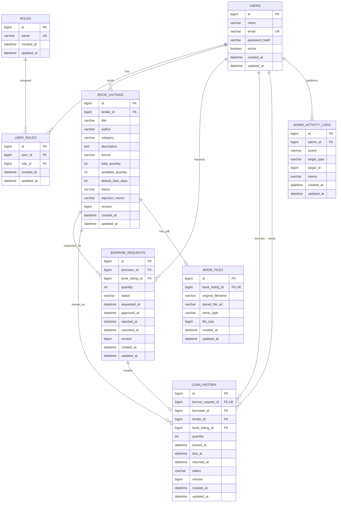

# 책 대여 플랫폼 설계

## 1. 전체 설계 요약

- 사용자는 `users`와 `roles` 사이의 명시적 연결 엔티티 `user_roles`를 통해 BORROWER, LENDER, ADMIN 역할을 동시에 가질 수 있다.
- LENDER가 등록한 책은 PENDING으로 시작하며 ADMIN 승인 후에만 공개 및 대여 요청이 가능하다.
- PDF 메타데이터는 `book_files`에 1:0..1로 분리한다. 서비스 계층에서 PDF는 파일 필수, 실물책은 파일 금지 규칙을 검증한다.
- 대여 요청 승인 트랜잭션은 요청 행과 책 행에 비관적 쓰기 잠금을 획득하고 재고 차감, 요청 승인, 대출 이력 생성, 관리자 로그 기록을 원자적으로 처리한다.
- 반납 트랜잭션도 대출과 책 행을 잠근 뒤 대출 상태 변경과 재고 복구를 원자적으로 처리한다.
- 대시보드는 별도 스냅샷 테이블 없이 기존 테이블의 count/query 결과를 조합한다.
- Entity는 외부로 노출하지 않고 Controller와 Service 경계에서 DTO만 사용한다.

## 2. Mermaid ERD



## 3. 테이블별 설명

| 테이블 | 책임과 핵심 제약 |
|---|---|
| `users` | 사용자 기본 정보. 이메일 유일성, 활성 상태, BCrypt 비밀번호 해시를 저장한다. |
| `roles` | BORROWER/LENDER/ADMIN 역할 기준 정보. `name`은 문자열 enum이자 unique이다. |
| `user_roles` | 사용자와 역할의 다대다 연결. `(user_id, role_id)` unique로 중복 부여를 방지한다. |
| `book_listings` | 등록 책과 재고의 원장. 상태/등록자 인덱스, 수량 CHECK, JPA `@Version`을 둔다. |
| `book_files` | PDF 파일 메타데이터. `book_listing_id` unique로 책당 최대 한 파일만 허용한다. |
| `borrow_requests` | 대여 의사결정 기록. 승인/거절/취소 시각과 상태를 유지한다. 요청은 재고를 선점하지 않는다. |
| `loan_history` | 승인된 요청의 실제 대출 원장. `borrow_request_id` unique로 요청당 최대 한 대출만 생성한다. |
| `admin_activity_logs` | 책/요청 승인 및 거절 등 운영자 감사 로그. 대상은 type/id의 논리적 참조로 기록한다. |

모든 enum은 `EnumType.STRING`으로 저장한다. 삭제/비활성 책은 물리 삭제 대신 `INACTIVE`, `DELETED` 상태로 확장 가능하다.

## 4. 패키지 구조

```text
com.example.bookrental
├── config       # Clock, BCrypt, 역할 초기화
├── controller   # REST API와 DTO 입출력
├── domain       # JPA Entity와 도메인 상태 변경 메서드
│   └── enums    # 역할/책/요청/대출/관리자 행동 enum
├── dto          # 요청/응답 record
├── exception    # 비즈니스/권한/404 및 전역 예외 응답
├── repository   # Spring Data JPA, 통계 query, 비관적 lock query
├── security     # 추후 SecurityContext로 교체할 권한 검사 경계
└── service      # 트랜잭션과 유스케이스
```

## 5. 구현 API

### 사용자와 역할
- `POST /api/users`
- `POST /api/users/{userId}/roles`
- `GET /api/users/{userId}`

### 등록자 (`X-User-Id`)
- `POST /api/lender/books`
- `GET /api/lender/books`
- `PATCH /api/lender/books/{bookId}`

### 대여자 (`X-User-Id`)
- `GET /api/books`
- `GET /api/books/{bookId}`
- `POST /api/borrow-requests`
- `GET /api/borrow-requests/me`
- `PATCH /api/loans/{loanId}/return`

### 운영자 (`X-Admin-Id`)
- `GET /api/admin/books/pending`
- `PATCH /api/admin/books/{bookId}/approve`
- `PATCH /api/admin/books/{bookId}/reject`
- `GET /api/admin/borrow-requests`
- `PATCH /api/admin/borrow-requests/{requestId}/approve`
- `PATCH /api/admin/borrow-requests/{requestId}/reject`
- `GET /api/admin/loans`
- `GET /api/admin/loans/overdue`
- `GET /api/admin/dashboard`

`X-User-Id`와 `X-Admin-Id`는 개발 단계의 임시 actor 전달 방식이다. JWT 도입 시 Controller에서 ID를 신뢰하지 말고, 인증 필터가 검증한 Principal/SecurityContext를 사용해야 한다.

## 6. 주요 비즈니스 로직

### 책 등록과 승인
1. LENDER 역할을 확인한다.
2. 총 수량/가용 수량/대여 기간과 PDF 파일 조건을 검증한다.
3. 책을 PENDING으로 저장한다.
4. ADMIN 승인/거절 시 책 행을 잠그고 상태 변경과 감사 로그를 같은 트랜잭션에 저장한다.

### 대여 요청과 승인
1. BORROWER는 APPROVED 책만 요청할 수 있다.
2. 요청 시점의 가용 수량은 빠른 실패를 위해 검사하지만 재고를 예약하지 않는다.
3. 승인 시 `borrow_requests`와 `book_listings`를 `PESSIMISTIC_WRITE`로 잠근다.
4. 잠금 획득 후 가용 수량을 다시 검사하고 차감한다.
5. 요청을 APPROVED로 변경하고 dueAt을 `승인 시각 + 기본 대여 일수`로 계산해 대출을 생성한다.
6. 어느 단계든 실패하면 트랜잭션 전체가 롤백되므로 음수 재고나 승인만 된 요청이 남지 않는다.

### 반납과 연체
- 대여자 또는 ADMIN만 반납할 수 있다.
- 대출 행과 책 행을 잠그고 LOANED/OVERDUE를 RETURNED로 바꾸면서 수량을 복구한다.
- 연체 조회는 `OVERDUE`이거나 `LOANED AND due_at < now`인 행을 조회하고 상태를 OVERDUE로 동기화한다.
- 대규모 운영 환경에서는 별도 스케줄러/배치로 연체 상태를 주기적으로 갱신하는 것이 좋다.

### Dashboard
각 수치는 repository 집계 쿼리로 계산한다. 최근 목록은 생성/요청 시각 역순 상위 5건이다. 역할별 사용자 수는 `distinct user_id`를 사용하므로 다중 역할 사용자가 전체 사용자 수와 역할별 수에 각각 올바르게 반영된다.

## 7. 테스트

`BookRentalFlowIntegrationTest`는 다음을 검증한다.
- 책 등록 → 관리자 승인 → 대여 요청 → 요청 승인/재고 차감 → 반납/재고 복구 전체 흐름
- 동일한 1권에 대한 복수 요청 중 첫 승인 후 두 번째 승인이 실패하고, 재고가 음수가 되지 않으며 실패 요청이 REQUESTED로 유지되는 흐름

## 8. 추가 개선 포인트

1. Spring Security + JWT/refresh token, 인증 Principal 기반 actor 추출, `@PreAuthorize` 적용
2. 사용자 역할 부여 API를 ADMIN 전용으로 제한하고 사용자 정지/복구 API 추가
3. S3 presigned URL 업로드, 파일 checksum/악성코드 검사, PDF DRM 또는 접근 만료 URL
4. 목록 API에 커서 페이지네이션, 검색(제목/저자/카테고리), 정렬 조건 추가
5. 요청 만료 배치, 연체 전환 스케줄러, 알림 outbox와 메시지 브로커 도입
6. 재고 변경 이력 테이블 및 LOST/CANCELED 처리 정책 추가
7. idempotency key를 승인/반납 API에 적용하고 분산 환경에서 중복 명령 방지
8. 관리자 로그에 요청 IP, correlation ID, 변경 전후 snapshot을 추가
9. Testcontainers MySQL 통합 테스트로 실제 InnoDB 잠금과 Flyway DDL 검증
10. 대시보드 트래픽 증가 시 read replica, 캐시 또는 집계 materialization을 검토하되 원본 데이터가 source of truth가 되도록 유지
